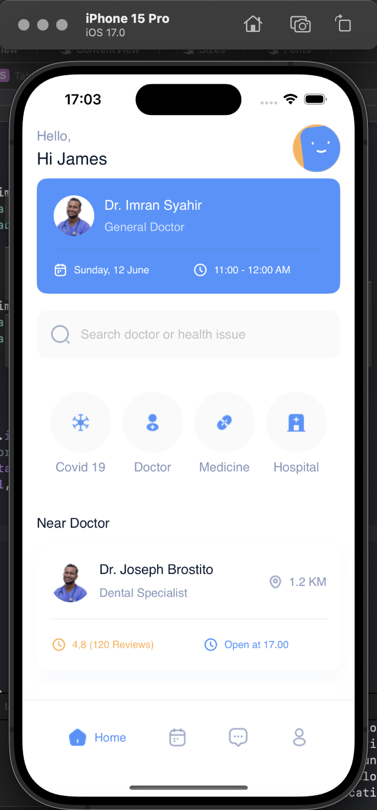
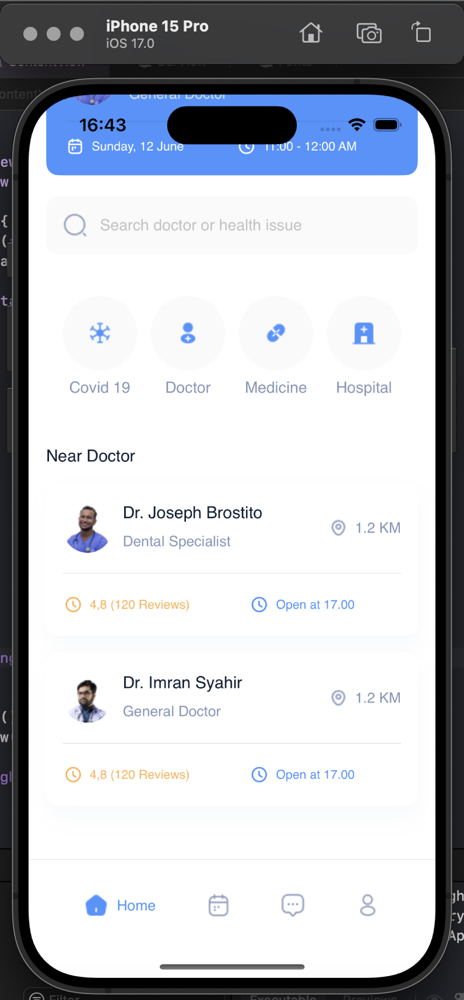

# digital_department_ios

## Описание проекта
Это проект экрана приложения, написанный на Swift c использованием SwiftUI. На экране присутствуют следующие элементы:

- **Шапка**: Заголовок.
- **Карта**: Карта выбранного доктора.
- **Поиск**: Строка поиска.
- **Направления**: Разделы с информацией.
- **Доктора**: Общая информация о доктарах.
- **Навигация**: Панель для навигации по приложению.

## Структура проекта
- **`ContentView`**: Главный файл для компиляции всего приложения.
- **`HeadView`**:  Шапка экрана.
- **`CardView`**: Карта выбранного врача.
- **`SearchView`**: Строка поиска. 
- **`InformationView`**: Разделы с информацией.
- **`DoctorView`**: Общая информация о докторах.
- **`BarView`**: Панель для навигации по приложению.

## Технологии
- Swift и SwiftUI

## Как использовать
1. Клонируйте репозиторий.
2. Удалите файл README в проекте.
3. Откройте проект в вашей IDE.
4. Запустите проект и убедитесь, что у вас установлены все необходимые зависимости.

## Автор
Автор: Шереметьев Кирилл Алексеевич
